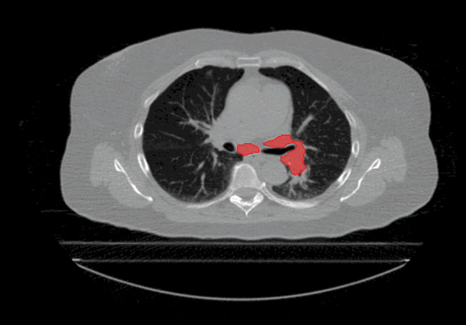

# Tumor Motion Analysis
Welcome to the Tumour Motion Analysis Repository! This repository is dedicated to the in-depth motion analysis of mobile lung cancer tumours. The project encompasses various algorithms and techniques to quantify motion, including Centre of Mass Displacement, Image Deformation, Volume Tracking, and a Voxel-Wise Motion Analysis. The algorithms can be implemented for any applications where motion is described by sequential timed snapshots representations. In our example we analyse tumour motion from 4D Computed-Tomography (4D-CT) scans of the thorax region. This repository provides valuable tools and insights for the comprehensive analysis of tumour motion in the context of proton therapy and proton treatment planning.

 

  

## Overview
In thoracic tumor cases, intrafractional motion has a profound impact on radiation therapy efficacy, particularly in proton beam therapy. This motion encompasses the dynamic internal movements of anatomical structures, including the tumour, organs, and bone structures, induced by the patient's respiratory cycle. Identifying patients who benefit from treatments accounting for minimal motion effects, such as proton pencil beam scanning, is crucial. Intrafractional motion's effects include geometrical misses, proton range uncertainties, and interplay effects. Geometrical misses result from tumor movement and volumetric variations during irradiation, potentially leading to spatial misalignment and target underdosage. Proton range uncertainties stem from dynamic motion of the region, altering the proton’s stopping power and introducing dose uncertainties. Our repository [Proton Beam Optimisation: Strategies for Personalised Lung Cancer Therapy](https://github.com/FotiouK/Proton_Beam_Optimisation-_Strategies_for_Personalised_Lung_Cancer_Therapy?tab=readme-ov-file) offers an in-depth analysis and a beam optimisation algorithm to minimise proton range uncertainties. For highly modulated therapies like proton therapy pencil beam scanning and X-ray VMAT therapies, interplay effects are vital, causing dose inhomogeneity and creating under- and overdose regions due to the dynamic natures of the beam delivery and the tumour motion.
  The repository is dedicated to evaluating tumour motion based on 4D-CT scans to gain insights into intrafractional motion, with the following algorithms:
  - **Centre of Mass Displacement:** Quantifying tumour motion through the Centre of Mass (CoM) location of the tumor during the respiratory cycle.
  - **Image Deformation:** Assessing tumor motion amplitude by registering tumor regions from different phases, revealing deformation vectors.
  - **Volume Tracking:** Monitoring changes in tumour size throughout the respiratory cycle.
  - **Voxel-Wise Motion Analysis (Tumor Location Probability Map):** Providing a comprehensive understanding of tumor motion through a Tumor Location Probability (TLP) map.

## Centre of Mass Displacement

The primary focus of this method is to quantify the motion of the tumour based on the position of the Centre of Mass (CoM) of the tumor for each phase of the respiratory cycle. It employs Euclidean geometry to determine the maximum and average displacement, providing essential insights into tumor motion.
 

 The CoM coordinate of the tumour volume is calculated for each phase, assuming uniform tumor density. This information is then utilised to generate a 3D scatter plot, visualising the motion of the tumor throughout the breathing cycle.
  To quantify the displacement between tumor phases, the Euclidean distance between the CoM coordinates is scaled with the voxel dimensions and then iterate between all phase combinations. The maximum and average CoM displacement is thus computed and utilised to quantify the motion of the tumour. These displacement values provide valuable information for characterising tumour motion and are instrumental in the context of radiation therapy treatment planning.
 
 
 
 

## Image Deformation
The image deformation algorithm is designed to assess tumour motion amplitude through the process of image registration. It involves aligning the tumour regions from different phases to quantify their motion characteristics. This approach relies on calculating deformation vectors to enumerate the motion between two phases relative to an origin point. The reference point used for image registration is the CoM of the ICTV (Internal Clinical Target Volume), which corresponds to the isocentre position commonly used for radiotherapy treatment planning. Additionally, the scan voxel dimensions are incorporated to ensure that the calculated displacements are in millimetres. The implementation of this algorithm leverages the multi-dimensional image analysis Python library, SimpleITK.
  The key steps of the image deformation approach are as follows:
- _Transformation Model_: The algorithm utilises a translation transform to represent motion along each axis.
-  _Optimisation_: The goal is to find the optimal transformation aligning tumour regions in reference and current frames. The mean squares metric measures dissimilarity by averaging the squared differences of corresponding pixels while a regular step gradient descent is employed to iteratively refine transformation parameters.
- _Deformation Vector_: After optimisation, the final transform reveals the deformation between two tumour frames. Deformation vectors are then extracted, signifying tumor region displacement.
- _Displacement Analysis_: Deformation vectors from all frames are accumulated to infer maximum tumor displacement by interpolating vector magnitudes. Directional tumor displacement is also determined by assessing peak-to-peak differences along each of the three axes.

 
In summary, the image deformation approach achieves its goal through the iterative optimisation of a transformation model to align tumor regions from different phases. Tumor displacement is quantified through deformation vectors, allowing for the extraction of directional motion amplitude and maximum motion amplitude. This process is iterated between all possible tumour phase combinations to identify the maximum overall and directional displacement over the whole breathing phase.

## Volume Tracking
The Volume Tracking section focuses on monitoring changes in tumour size throughout the respiratory cycle. This is achieved by quantifying the tumour volume within the delineations of the Gross Tumor Volume (GTV), with volumes expressed in cubic centimetres (cc), the standard clinical format for tumour volume measurement. The approach involves evaluating the volume of the GTV for all phases of the breathing cycle, providing a comprehensive understanding of tumour volume variations.
  To account for varying tumour sizes found in a clinical environment, we introduce the Percentage Volume Variation (PVV) metric. PVV enables the comparison of volume variations among different patients and is defined as follows:
 

$$
PVV = (V_{max} - V_{min}) * 100 / V_{mean} 
$$

The PVV metric facilitates the comparison of tumor expansion and contraction relative to the average volume, allowing for comparisons between tumors of varying sizes. The volume tracking analysis provides valuable insights into how tumour size changes during the respiratory cycle, which is essential information for radiation therapy treatment planning.

  

## Voxel-Wise Motion Analysis (Tumour Location Probability Map)
The Voxel-Wise Motion Analysis section introduces the Tumour Location Probability (TLP) map, a crucial metric for understanding tumour motion within the thorax. The TLP map encapsulates both tumour displacement and volumetric variations by representing the likelihood of finding the tumour at each voxel throughout the entire breathing cycle. Each voxel in the TLP map corresponds to a specific location within the imaging volume, with voxel values denoting the probability of the tumour’s presence at that particular voxel at any point in the respiratory cycle.
  The Tumor Location Probability (TLP) map is generated by first transforming input arrays, where tumour presence pixels are assigned a value of 1/N (N being the number of phases) and tumor absence pixels are set to 0. Geometric summation of these transformed arrays identifies pixels with tumour presence across multiple phases. Extrapolating this methodology over all motion snapshot representations (this case the 10 breathing phases), results in the TLP map. Voxel values in this map range from 0 to 1, with 1 indicating constant tumor presence. Analysis of the TLP voxels allows for a comprehensive understanding of tumor motion, incorporating both movement mechanisms and providing insights into the progression of tumour motion in a single variable.

 

While volume variation and tumour movement metrics focus on extreme measurements from individual phases, the Tumour Location Probability (TLP) map offers a comprehensive perspective by evenly considering motion across all phases. It amalgamates both movement mechanisms and presents a unified view of tumour motion progression. In additions, the TLP map proves invaluable for comparing patients which exhibit similar motion characteristics.
  The TLP map utilises  colour coding to represent voxel probabilities, providing insights into tumour motion. For a more detailed understanding, cross-sectional representations at the iso-centre position can be examined, covering axial, coronal, and sagittal planes, with axes labelled in voxel numbers as illustrated below. The visualisation below was extracted at the isocentre plane where the isocentre coordinate is denoted with a blue X 

  

## Getting Started
Whether you're a researcher, a medical professional, or an enthusiast interested in medical image analysis, our repository offers a comprehensive workflow to delve into the nuances of tumour motion analysis. To begin, explore the detailed documentation and code for each technique presented in the repository. Feel free to refer to the documentation, and please don't hesitate to reach out if you have any questions or feedback.

## License 
This project is provided under the MIT License. You are welcome to use, modify, and distribute the codes presented in the repository under the terms of the MIT License. Please refer to the "LICENSE" file and the accompanying license documentation for full details.
Please be aware that this project was intended for research purposes only.

## Contact
If you have any questions, suggestions, or need assistance, please do not hesitate to contact us at [kyriakosfotiou1@gmail.com](mailto:kyriakosfotiou1@gmail.com).

